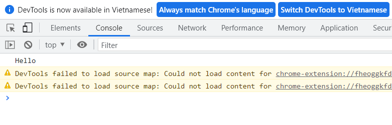
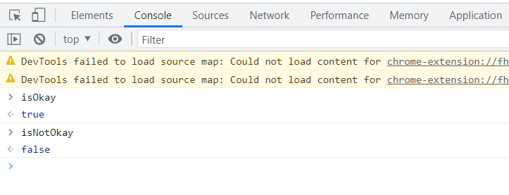
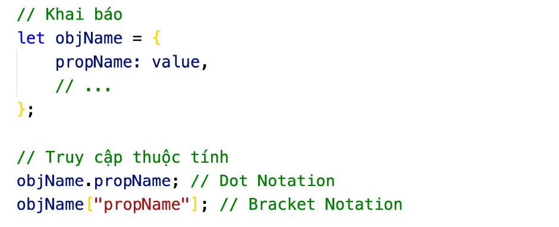

# Tổng Hợp kiến thức

### 1. Cách nhúng Java Script

- Nhúng inline:

```html
<h1 onclick="alert(Hello JS)">...</h1>
```

- Nhúng internal:

```html
<script>
  alert(""Hello JS");
</script>
```

-Nhúng External:

```html
<script src="script.js"></script>
```

### 2. Cửa sổ thông báo

- Alert để hiển thị 1 bảng cảnh báo trên trình duyệt với các thông điệp. VD:

```js
alert("hello");
```


- Confirm để hiển thị bảng chọn yes/no trên trình duyệt dể hổi người dùng. VD:

```js
confirm("Are you ok?);
```


- Prompt() để hiển thị một bảng input cho người dùng nhập dữ liệu vào. VD:

```js
prompt("Nhập tên của bạn:");
```


- Console.log() để in 1 thông báo, ra tab console. VD:

```js
console.log("Hello");
```



### 3.Variables (Biến)

Biến là yếu tố cơ bản của bất kỳ ngôn ngữ lập trình nào. Biến là tên một vùng nhớ lưu trữ dữ liệu trong bộ nhớ máy tính. Cú pháp khai báo biến trong JavaScript:

```js
let myName = "Tùng Nguyễn";
const MY_BIRTHDAY = 2000;

let a = (b = 10);
let x = 1,
  y = 2;
```


- Biến khai báo với let không thể khai báo lại, tuy nhiên, giá trị của biến có thể thay đổi.
- Biến khai báo với const (hằng số) không thể khai báo lại, và cũng không thể thay đổi giá trị.

```js
let myName = "Tùng Nguyễn";
//Error
let myName = "Tùng Shin";
//Ok
myName = "Tùng Shin";

const MY_BIRTHDAY = 2000;
//Error
const MY_BIRTHDAY = 1999;
//Error
MY_BIRTHDAY = 1999;
```


#### Quy tắc và quy ước đặt tên biến

##### Quy tắc:

- Tên biến chỉ được chứa ký tự, số, hoặc ký tự đặc biệt $ và \_
- Tên biến không được bắt đầu bằng một số
- Tên biến có phân biệt chữ hoa, chữ thường
- Tên biến không được trùng với từ khóa của JavaScript

##### Quy ước:

- JavaScript sử dụng phong cách camelCase cho tên biến, hoặc hàm
- Với hằng số - const - sử dụng UPPERCASE

### 4. Các kiểu dữ liệu (Data types)

Có 9 kiểu dữ liệu: Number, String, Bigint, Boolean, Undefined, Null, Symbol, Object, Function.
Trong đó 2 kiểu dữ liệu Bigint và Symbol ít được dùng.

##### Number

Bao gồm cả số nguyên và số thực, giới hạn -2^53 + 1 đến 2^53 - 1

```js
let interger = 22;
let negative = -22;
let float = 2.2;
let money = 1_500_000; //có thể dùng dấu _ để ngăn cách giữa các phần nghìn cho dễ đọc.

// Một số giá trị đặc biệt:
// Infinity; //vô cực
// -Infinity; //âm vô cực
// NaN; // Not a Number - đại diện cho 1 phép tính sai vd: abc/12 //
```

##### String

Chuỗi được bọc trong dấu "" hoặc '' hoặc ``

```js
let firstname = "Tùng";
let lastname = " Nguyễn";

//Nối chuỗi
Let hello = "Hello, " + lastname + " " +  firstname;
```


##### Boolean (logic)

Kiểu `boolean` hay `logic` chỉ bao gồm hai giá trị `true` hoặc `false`

```js
let isOkay = true;
let isNotOkay = false;
```



##### Undefined

Đại diện cho những biến chưa đc gắn giá trị

```js
let x; //undefined
```

##### Null

Đại diện cho một đối tượng không tồn tại. Khi muốn xoá giá trị cho biến, ta gán giá trị đó là null.

```js
null;
```

##### Object

Object là kiểu dữ liệu đặc biệt, cho phép lưu trữ cùng lúc nhiều giá trị trong một biến duy nhất, các dữ liệu được lưu trong object có thể thuộc bất kỳ kiểu nào.

_Cách khai báo object_



_Ví dụ_

```js
let tung = {
  name: "Nguyễn Văn Tùng",
  age: 22,
  address: "Ba Vì",
};

console.log(tung);
console.log(tung.name);
console.log(tung.age);
console.log(tung.address);
```


##### Function (Hàm)

Function là cách thức tổ chức mã cơ bản trong JavaScript, function được sử dụng để đóng gói một đoạn mã để xử lý một công việc/tính toán giá trị nào đó, cho phép tái sử dụng đoạn mã ở nhiều nơi trong chương trình.

_Cách khai báo function_


_Ví dụ_

```js
let hello = function (address) {
    console.log("Chào bạn"!);
    console.log("Bạn đến từ đâu?");
    console.log("Tôi đến từ:", address);
    console.log("Cảm ơn bạn!");
}

hello(Ba Vì);
```


# Toán Tử

Toán tử trong JavaScript được chia thành 5 loại:

- Arithmetic
- Comparision
- Assignment
- Logical
- Bitwise
  Quy tắc thực hiện biểu thức theo thứ tự từ trái qua phải, dựa theo độ ưu tiên toán tử. Các toán tử có độ
  ưu tiên khác nhau, quyết định phép tính nào sẽ được thực hiện trước
  JavaScript cũng tự động chuyển đổi các kiểu dữ liệu của các toán hạng về kiểu phù hợp khi thực hiện
  các biểu thức tính toán hay so sánh

### 1. Quy tắc chuyển đổi kiểu dữ liệu

- Với phép +:
  Nếu 1 trong 2 hạng(giá trị) có kiểu chuỗi thì giá trị còn lại cũng chuyển sang chuỗi.

- Các toán tử khác:
  Thì ưu tiên chuyển sang số. (-, \*, /, ....)

```js
let add = 1 + 1; // 2
let result = "4 - 2" = add;
// add từ number chuyển thành string => kết quả bằng "4 -2 = 2"

let sub = 10 - "6"; // 4
//"6" từ string chuyển thành number
```

##### Chuyển đổi kiểu dữ liệu

- Chuyển đổi kiểu về string

```js
string(10); // => "10"
string(false); //=> "false"
```

- Chuyển đổi kiểu về number

```js
number("123"); //=> 123

//Một số giá trị đặc biệt:
number(null); // => 0
number(undefined); // => NaN
number(true); // => 1
number(false); // => 0
number("    12    "); // => 12
number("66tung"); // => NaN
number(""); // => 0
```

- Chuyển đổi kiểu về boolean

```js
boolean(100); // => true

//Một số giá trị đặc biệt
"", 0, null, undefined, NaN; // => false
//còn lại tất cả các giá trị là true
```

### 2.Arithmetic Operator:

- Các toán tử cơ bản: + = \* / % \*\*

```js
//Chia lấy phần dư
7 % 3; // => 1
20 % 5; // => 0

//Luỹ thừa

5 ** 2; //=> 25
6 ** 3; //=>216

// Mọi phép tính (trừ nối chuỗi ) với NaN đều cho kết quả là NaN:

NaN - 15; // => NaN
```

- Toán tự tăng/giảm:
  ++ và -- là hai toán tử đặc biệt, nó thực hiện phép tính tăng/giảm giá trị của biến đi 1, hai toán tử này có thể đặt ở trước biến - prefix hoặc sau biến - postfix. Khi sử dụng trong một câu lệnh riêng biệt thì không có sự khác nhau.

```js
let a = 10;
a++; // => 11
++a; // => 12
a--; // => 11
--a; // => 10
```

có 2 cách sử dụng

```js
//  Kết quả khác nhau khi sử dụng trong 1 biểu thức

let a = 1;

//  sử dụng sau tên biến:

a++;
//  Thực hiện phép tính trước rồi mới tăng:

let result = 10 + a++; //11, a=>2

//  Sử dụng trước tên biến:
++a;
--a;
// Tăng giá trị của biến trước rồi mới tính
let result = 10 + ++a; // 12, a=>2
```

##### equal == != : => Tự động chuyển đổi kiểu

strict qual === !== :so sánh nghiêm ngặt => So sánh cả kiểu dữ liệu

Câu hỏi thường hỏi khi pv:

1.  Các toán tử ++ --
2.  sự khác nhau giữa==,=== ; !=,!==

##### Logic

NOT - ! (phủ định)
!true = false
!false = true

##### AND = &&

Đánh giá toán hạng/biểu thức thành giá trị logic
trả về kq đầu tiên là false
nếu không có toán hạng nào là false thì trả về thằng cuối cùng
true&&true = true
false&&fale = false
"tùng Shin" && 0 =0

##### OR - ||

Đánh giá toán hạng(biểu thức) thành giá trị logic
trả về kq đầu tiên là true
nếu k có true => trả về thằng cuối cùng
true||false = true
false||flase = false
